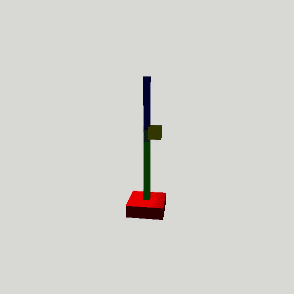

# ML-Arm

## Data:
- To fit the Model, the file `data.csv` is used.

## Prediction Classes:
-   0 : rotation0+ rotation1+ angle+
-   1 : rotation0-  rotation1+ angle+
-   2 : rotation0-  rotation1-  angle+
-   3 : rotation0+ rotation1-  angle+
-  4 : rotation0+ rotation1+ angle-
-  5 : rotation0-  rotation1+ angle-
-  6 : rotation0-  rotation1-  angle-
-  7 : rotation0+ rotation1-  angle-

## Buttons:
- `P`: Auto movement.
- `L`: Prints rotations.
- `Left`: Rotate camera to the left.
- `Right`: Rotate camera to the right.
- `A`: Increase arm angle.
- `S`: Reduce arm angle.
- `D`: Increase arm rotation.
- `F`: Reduce arm rotation.
- `Z`: Increase arm1 rotation.
- `X`: Reduce arm1 rotation.
- `Space`: Moves ball to a random position.
- `Escape`: Exit.

Example:

